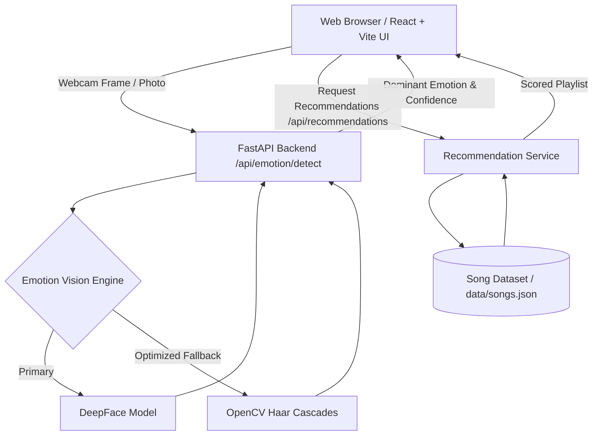

# MoodTune AI

> **Music Recommendation Based on Facial Expressions**  
> *"Music that understands your mood."*

MoodTune AI is an intelligent full-stack web application that analyzes user facial expressions using computer vision and machine learning to recommend perfectly matched music playlists in real time.

---

> [!IMPORTANT]
> **Disclaimer**: Facial expression analysis provides an estimated expression/emotion and should not be interpreted as a definitive measurement of a person's internal emotional state.

---

## 1. Project Overview

Music and emotional well-being are intrinsically connected. MoodTune AI bridges human facial expressions and audio curation by estimating dominant expressions (Happy, Sad, Angry, Neutral, Surprise, Fear, Disgust) through browser webcam feeds or photo uploads and computing a tailored soundtrack to match or elevate the user's mood.

---

## 2. Features

- **Real-Time Facial Expression Detection**: Live camera detection powered by a dual-engine architecture (DeepFace AI with OpenCV Haar Cascade fallback).
- **Flexible Photo Upload**: Upload any portrait or selfie photo for instantaneous expression analysis without requiring a webcam.
- **Interactive In-App Music Player**: Built-in video & audio player modal to listen to tracks, preview songs, and view energy meters directly in the browser.
- **Smart Recommendation Scoring**: Multi-factor ranking algorithm considering emotion compatibility (50%), mood synergy (20%), genre preferences (15%), and energy levels (10%).
- **Instant Mood Selector**: Quick-switch buttons allowing users to explore playlists for any emotion on the fly.
- **Search & Filtering**: Search songs by title or artist, and filter by genre (Pop, Rock, Indie, Lo-Fi, Funk, Classical) and energy levels (Low, Medium, High).
- **Favorites & Detection History**: Save favorite tracks and view past detection history stored locally in browser storage.
- **Privacy-Preserving**: All image frames are processed in-memory and discarded immediately; no facial data is stored or logged.

---

## 3. Technologies Used

### Frontend
- **React 18** & **Vite**: Ultra-fast component rendering and development server.
- **Tailwind CSS**: Glassmorphic, responsive modern dark UI.
- **Lucide React**: Clean icons.
- **Axios**: HTTP client for API communication.
- **HTML5 Canvas & WebRTC**: Camera streaming and frame processing.

### Backend
- **Python 3.10+**: Core backend runtime.
- **FastAPI**: Asynchronous high-performance REST API.
- **Uvicorn**: ASGI web server.
- **Pydantic**: Data schema validation.
- **OpenCV (`opencv-python`)**: Computer vision, face detection cascades, and landmark analysis.
- **DeepFace**: Deep learning facial attribute analysis.

### Data
- JSON song catalog featuring track metadata (mood, energy, genre, emotion, language, streaming link).

---

## 4. System Architecture



---

## 5. Project Structure

```
Music_recommentation/
├── backend/
│   ├── app/
│   │   ├── models/
│   │   │   └── schemas.py          # Pydantic request/response models
│   │   ├── routes/
│   │   │   ├── emotion.py          # Emotion detection routes
│   │   │   ├── recommendations.py  # Recommendation routes
│   │   │   └── songs.py            # Song catalog and search routes
│   │   ├── services/
│   │   │   ├── emotion_service.py  # Dual-engine face & emotion detector
│   │   │   ├── music_service.py    # Song database access & search
│   │   │   └── recommendation_service.py # Scoring & ranking algorithm
│   │   ├── utils/
│   │   │   └── helpers.py          # Helper utilities
│   │   └── main.py                 # FastAPI application entry point & CORS
│   ├── tests/
│   │   └── test_health.py          # Pytest suite
│   ├── .env.example                # Backend environment template
│   └── requirements.txt            # Python dependencies
├── data/
│   └── songs.json                  # Curated song database with mood & energy
├── frontend/
│   ├── src/
│   │   ├── components/
│   │   │   ├── CameraView.jsx       # Camera stream, photo upload, and instant mood picker
│   │   │   ├── EmotionCard.jsx      # Emotion badge and confidence meter
│   │   │   ├── ErrorMessage.jsx     # User feedback alerts
│   │   │   ├── Footer.jsx           # Application footer
│   │   │   ├── LoadingSpinner.jsx   # Animated loading indicator
│   │   │   ├── MusicPlayerModal.jsx # In-app audio/video music preview player
│   │   │   ├── Navbar.jsx           # Navigation header
│   │   │   ├── SongCard.jsx         # Song display with play & favorite controls
│   │   │   └── SongGrid.jsx         # Responsive grid container
│   │   ├── pages/
│   │   │   ├── About.jsx            # Project information & vision
│   │   │   ├── History.jsx          # Detection history and favorite songs
│   │   │   ├── Home.jsx             # Landing page with interactive demo
│   │   │   └── Recommendations.jsx  # Main recommendation & player view
│   │   ├── services/
│   │   │   └── api.js               # Axios API service
│   │   ├── utils/
│   │   │   ├── emotionUtils.js      # Emoji mappings and color themes
│   │   │   └── storage.js           # LocalStorage history & favorites manager
│   │   ├── App.jsx                  # Main React component
│   │   ├── main.jsx                 # React root renderer
│   │   └── index.css                # Tailwind CSS styles
│   ├── .env.example                 # Frontend environment template
│   ├── package.json                 # Node dependencies
│   ├── tailwind.config.js           # Tailwind theme configuration
│   └── vite.config.js               # Vite build configuration
├── .gitignore                       # Git exclusions
├── LICENSE                          # MIT License
└── README.md                        # Documentation
```

---

## 6. Installation

Clone the repository to your local machine:

```bash
git clone https://github.com/Kokilapriya2003/Music-recommendation.git
cd Music-recommendation
```

---

## 7. Frontend Setup

1. Navigate to the frontend directory:
   ```bash
   cd frontend
   ```
2. Install npm packages:
   ```bash
   npm install
   ```
3. Copy environment configuration:
   ```bash
   cp .env.example .env
   ```

---

## 8. Backend Setup

1. Navigate to the backend directory:
   ```bash
   cd backend
   ```
2. Create and activate a virtual environment:
   ```bash
   # Windows (PowerShell)
   python -m venv venv
   .\venv\Scripts\Activate.ps1

   # Linux / macOS
   python3 -m venv venv
   source venv/bin/activate
   ```
3. Install dependencies:
   ```bash
   pip install -r requirements.txt
   ```
4. Copy environment configuration:
   ```bash
   cp .env.example .env
   ```

---

## 9. Environment Variables

### Backend (`backend/.env`)
```env
FRONTEND_URL=http://localhost:5173
HOST=0.0.0.0
PORT=8000
```

### Frontend (`frontend/.env`)
```env
VITE_API_URL=http://localhost:8000
```

---

## 10. Camera Permission

- The browser requires explicit permission to access the webcam via the WebRTC `navigator.mediaDevices.getUserMedia` API.
- Camera access requires a secure context (`localhost` or `https://`).
- If you deny camera access or do not possess a webcam, you can switch seamlessly to **Upload Photo** mode or use the **Quick Mood Selector**.

---

## 11. Emotion Detection

MoodTune AI uses a hybrid vision pipeline:
1. **Face Localization**: OpenCV Haar Cascade filters verify the presence of a single face (`faces_count == 1`). If zero or multiple faces are present, the user receives actionable feedback.
2. **Feature Extraction**:
   - When DeepFace is available, deep neural network embeddings classify expressions across 7 categories.
   - When offline or running in lightweight environments, the built-in OpenCV expression heuristic analyzes mouth curvature (smile cascade), eye aspect ratios, and intensity distributions.
3. **Classification**: Produces a dominant emotion tag (`happy`, `sad`, `angry`, `neutral`, `surprise`) with a normalized confidence score (0.0 to 1.0).

---

## 12. Music Recommendation

Songs are scored using a weighted multi-attribute formula:

$$\text{Score} = 0.50 \times M_{\text{emotion}} + 0.20 \times M_{\text{mood}} + 0.15 \times M_{\text{genre}} + 0.10 \times M_{\text{energy}} + 0.05 \times \text{Random}$$

- **Emotion Match (50%)**: Direct match between detected emotion and song emotion tag.
- **Mood Match (20%)**: Semantic match between emotion and song's mood descriptors (e.g., Energetic, Melancholy, Cheerful).
- **Genre Synergy (15%)**: Alignment with genres typical for the energy profile (e.g., Pop/Rock for high energy; Lo-Fi/Ambient for neutral/sad).
- **Energy Score (10%)**: Proximity between expected emotion valence/arousal and song tempo/energy.
- **Diversity Factor (5%)**: Subtle random variance to prevent playlist repetition.

---

## 13. API Endpoints

| Method | Endpoint | Description |
|---|---|---|
| `GET` | `/` | API status and documentation link |
| `GET` | `/api/health` | Health check endpoint |
| `POST` | `/api/emotion/detect` | Uploads an image frame (multipart/form-data) and returns detected emotion |
| `GET` | `/api/emotion/supported` | Returns supported emotion categories and descriptions |
| `POST` | `/api/recommendations` | Accepts `{ emotion: string, limit?: int }` and returns scored songs |
| `GET` | `/api/songs` | Returns all songs (supports `q`, `emotion`, `genre`, `mood` filters) |
| `GET` | `/api/songs/{emotion}` | Returns all songs matching a specific emotion |

Interactive Swagger documentation is available at `http://localhost:8000/docs`.

---

## 14. Running the Project

### Start Backend Server
From the `backend` directory:
```bash
uvicorn app.main:app --reload --host 0.0.0.0 --port 8000
```

### Start Frontend Application
From the `frontend` directory in a separate terminal:
```bash
npm run dev
```
Open [http://localhost:5173](http://localhost:5173) in your browser.

---

## 15. Troubleshooting

- **`No songs found`**: Ensure `data/songs.json` exists at the root of the project.
- **Camera not starting**: Check browser permissions under site settings; ensure no other app is using the webcam.
- **CORS Error**: Verify `FRONTEND_URL` in `backend/.env` matches your browser URL (default `http://localhost:5173`).
- **Tests failing**: Run `python -m pytest backend/tests` to verify backend integrity.

---

## 16. Privacy

- **In-Memory Processing**: Images captured via camera or uploaded are processed in volatile RAM and immediately discarded.
- **Zero Facial Storage**: No facial frames, photos, or biometric templates are stored on any disk or database.
- **Local Client History**: Detection history and favorites are stored exclusively inside the user's browser `localStorage`.

---

## 17. Limitations

- **Expression vs. Emotion**: Facial expressions do not always mirror true internal emotional states.
- **Lighting and Occlusion**: Low light, heavy shadows, face angles, and glasses can impact facial feature detection accuracy.
- **Single Person Optimized**: Designed for single-user interaction; frames with multiple people will prompt the user to center a single face.

---

## 18. Future Improvements

- Spotify and YouTube Music API OAuth integration for direct playlist saving.
- Continuous real-time video stream mood tracking during playlist playback.
- Multi-face mood consensus for group party playlists.
- User accounts and cloud-synced custom playlists.

---

## License

Distributed under the MIT License. See `LICENSE` for details.
